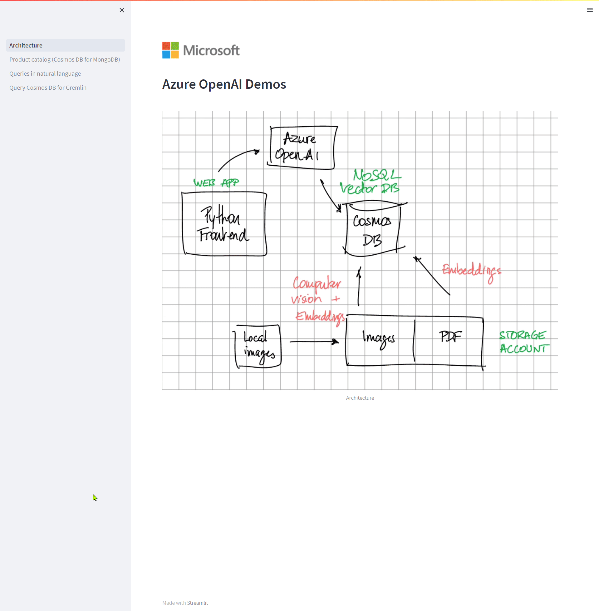

# Azure OpenAI Demos


## Product catalog search, using embeddings and Cosmos DB for MongoDB
This demo shows how to use Cosmos DB for MongoDB to search for products in a product catalog. 

The product catalog is stored in a Cosmos DB database. The product catalog is enriched with embeddings computed by Azure OpenAI (using text-ada-embedding-002). The search is performed by Cosmos DB for MongoDB and will return articles similar to the queried product

There are 105 442 products in the dataset.

The original Kaggle H&M dataset can be found here: https://www.kaggle.com/competitions/h-and-m-personalized-fashion-recommendations/data

## Query your SQL database with natural language
In this scenario, a user can describe the query in natural language. The query will then be converted to SQL code by Azure OpenAI and executed against a SQL database

## Query your Cosmos DB for Gremlin graph
In this scenario, a user can describe the query in natural language. The query will then be converted to Gremlin code by Azure OpenAI and executed against a Cosmos DB for Gremlin graph

## Setup

### 1-api backend
The backend code is a fastAPI Python application.

Set your variables in the api/.env file:
[Title](api/.env)

```
COSMOSDB_ENDPOINT=
COSMOSDB_KEY=
COSMOSDB_DATABASE_NAME=
COSMOSDB_CONTAINER_NAME=
COSMOSDB_GREMLIN_ENDPOINT=
COSMOSDB_GREMLIN_KEY=
COSMOSDB_GREMLIN_DATABASE_NAME=
COSMOSDB_GREMLIN_COLLECTION__NAME=
COSMOSDB_MONGODB_HOST=
COSMOSDB_MONGODB_USERNAME=
COSMOSDB_MONGODB_PASSWORD=
COSMOSDB_MONGODB_DATABASE=
COSMOSDB_MONGODB_COLLECTION=
COSMOSDB_MONGODB_PORT=27017
OPENAI_API_KEY=
OPENAI_ENDPOINT=
OPENAI_APITYPE = 'Azure'
MAX_TOKENS = 2048
TEMPERATURE = 0.1
MODEL_ENGINE = "text-davinci-003"
SQL_DATABASE_URL=

python -m venv venv
pip install -r requirements.txt
```

Run the backend api code:
```
uvicorn main:app --reload
```

### 2-frontend application
The frontend is a Streamlit application, running Python

Set your variables in the front/.env file:
[Title](front/.env)

```
OPENAI_ENGINES=text-davinci-003
OPENAI_EMBEDDINGS_ENDPOINT=
OPENAI_EMBEDDINGS_ENGINE_DOC=text-embedding-ada-002
OPENAI_EMBEDDINGS_ENGINE_QUERY=text-embedding-ada-002
OPENAI_API_BASE=
OPENAI_API_KEY=
OPENAI_API_TYPE=Azure
OPENAI_PERSONAL_KEY=
MAX_TOKENS=1000
TEMPERATURE=0
BLOB_ACCOUNT_NAME=
BLOB_ACCOUNT_KEY=
BLOB_CONTAINER_NAME=data
API_ENDPOINT=http://localhost:8000
ARTICLES=data/products.csv
SQL_SERVER_ENDPOINT=
SQL_SERVER_DATABASE=
SQL_SERVER_USERNAME=
SQL_SERVER_PASSWORD=

python -m venv venv
pip install -r requirements.txt
```

Run the frontend Streamlit application:
```
streamlit run Architecture.py
```
